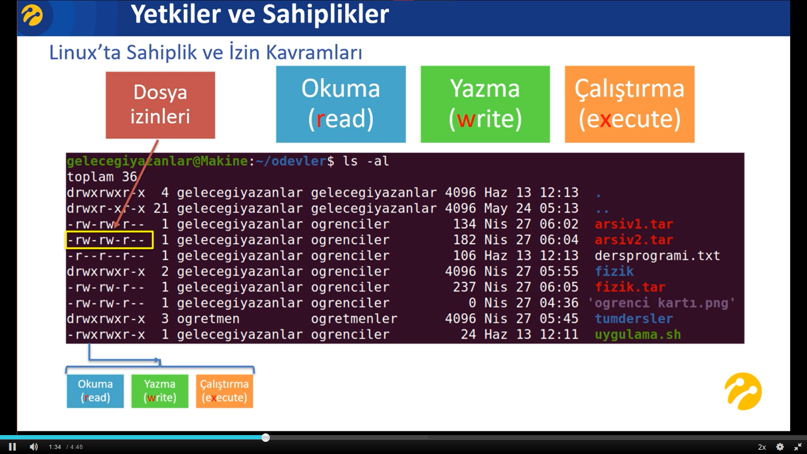

# 1-Yetkiler ve Sahiplikler Giriş
- Linux, çok kullanıcılı bir sistemdir.
- Dosyalar dizinler uygulamalar illa ki bir kullanıcıyla ve bir grupla ilişkilidir. Yani her dizin dosya ve uygulamanın sahibi olan bir kullanıcı ve bir grup bulunmaktadır. Tabiki bu uygulamalara dizinlere dosyalara erişirken hangi kullanıcı hangi grupla erişiyorsak o kullanıcı ve gruba tanımlanan izinler kapsamında erişebiliriz veya erişemeyiz.
- `r` => read
- `w` => write
- `x` => execute

- Dosya/uygulama/dizin izinlerinde 1. üç izin kullanıcının sahip olduğu yetkiler.
- Dosya/uygulama/dizin izinlerinde 2. üç izin grubun sahip olduğu yetkiler.
- Dosya/uygulama/dizin izinlerinde 3. üç izin diğer kullanıcıların sahip olduğu yetkiler.

# 2-Root Yetkileri ile Çalışma
- Sistemdeki en yüksek yetkili kullanıcı olan root'tur.

- root tüm erişim izinlerine sahiptir. Tüm dosyaları okuyabilir/değiştirebilir/çalıştırabilir.

- Tüm izinleri değiştirebilir.

- Tüm sahiplikleri değiştirebilir.

# 3-Dosya ve Dizinlerde Sahiplik Görüntüleme
- Öncelikle bir dizin altındaki dosyaların sahipliklerini/gruplarını görüntülüyebilmek için o dosya ve dizinleri ayrıntılı bir biçimde listelememiz gerekir.

- `ls -al` => ayrıntılı bir şekilde klasördeki dosyaları listeler
- `ll` => `ls -al` komutunun kısaltılmış halidir.

- 3.Sütunda o dosyanın sahibi kullnıcıyı 4.Sütunda ise o dosyanın sahibi grubu görebilirsiniz.

# 4-Dosya ve Dizinlerin Sahibini Değiştirme
- `sudo chown gelecegiyazanlar dosya1` => dosyanın sahibini böyle değiştirebiliriz.
- 
- `sudo chgrp gelecegiyazanlar dosya4` => dosyanın grubunu böyle değiştirebiliriz.

# 5-Toplu Sahiplik Değişiklikleri
- Bir dizinin sahipliğini değiştirirken içindeki dosyaların ve dizinlerin de sahiplikleri değişmez. Eğer değiştirmek istersek `sudo chown -R `

- `R`(recursive) : bir dizinin sahipliğini değiştirirken içinde bulunan dosyaların ve dizinlerin de sahipliklerini değiştirmemize yarar.

`sudo chown -R gelecegiyazanlar klasor1` => klasörü ve içindeki bütün dosyaların/dizinlerin sahipliklerini değiştirir.

`sudo chgroup -R gelecegiyazanlar klasor1` => klasörü ve içindeki bütün dosyaların/dizinlerin gruplarını değiştirir.

`sudo chown -R musa:musa *` => bu komut dizindeki tüm dosyaların ve dizinlerin onların içindekilerin her birinin sahipliklerini ve fruplarını aynı anda değiştirmeyi sağlar.

# 6-Dosya İzinlerini Listeleme
